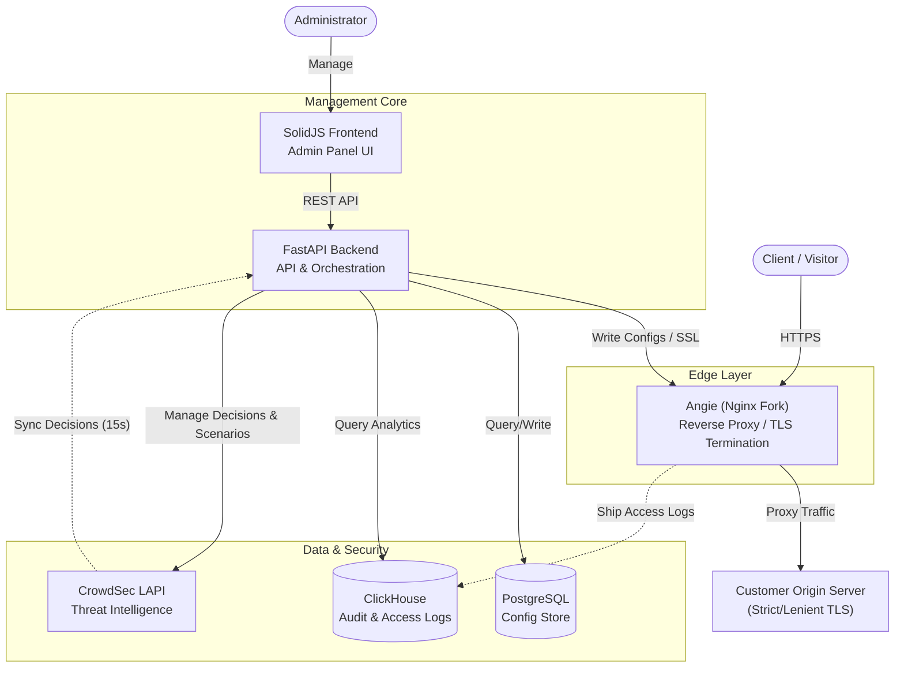
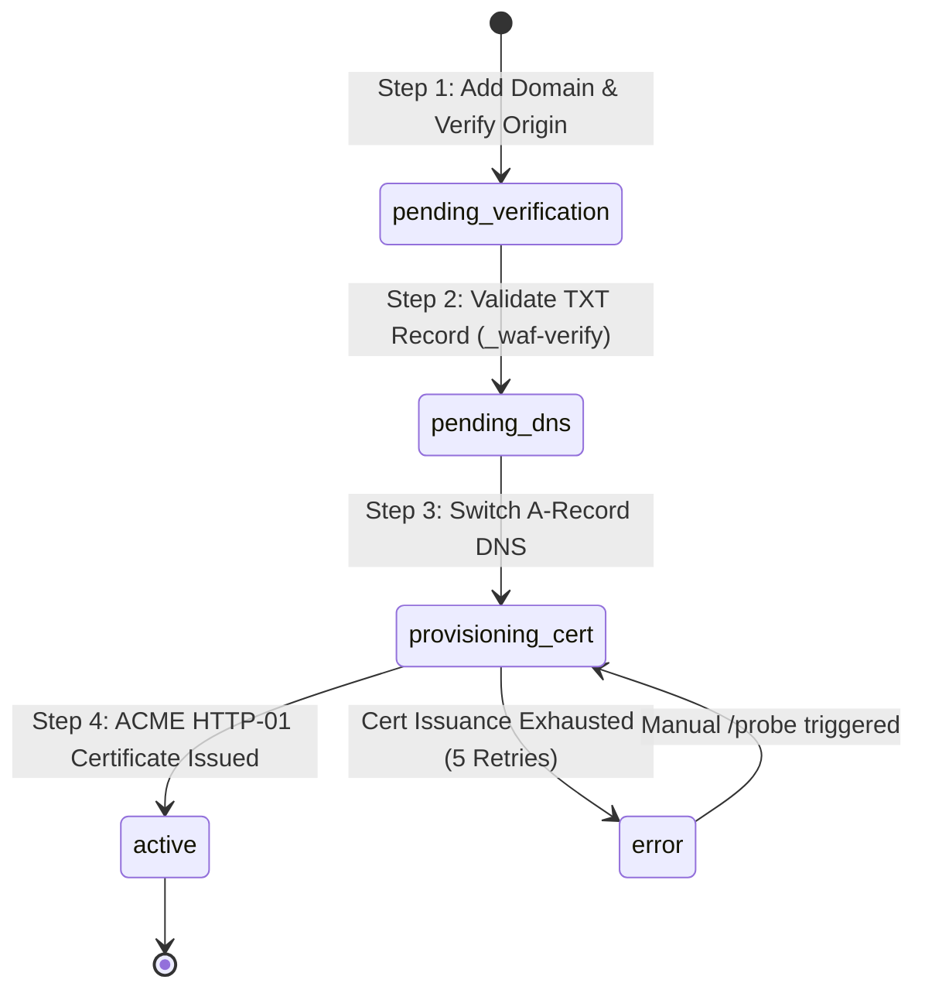

# 🛡️ WAF: Modern Multi-Tenant Web Application Firewall Edge

A high-performance, secure-by-default Web Application Firewall (WAF) edge service designed to act as a reverse proxy for tenant-owned origin servers. It integrates **Angie** (a modern Nginx fork) with **FastAPI**, **SolidJS**, **CrowdSec** (for tenant-isolated dynamic threat blocking), and **ClickHouse** (for real-time logging and analytics).

---

## 🚀 Key Features

*   **Domain-Only Onboarding:** A streamlined 3-step setup wizard (Domain setup, TXT verification, and DNS routing) that does not require customer-side server modifications or volume mounts.
*   **Tenant-Isolated Threat Blocking:** Prevents "cross-tenant leakage". CrowdSec dynamic bans are parsed and routed only to the specific tenant's virtual host configurations (`blocked_ips.conf`), ensuring that legitimate users sharing a NAT/VPN with a malicious bot are not globally blocked across all other tenant domains.
*   **Strict Security Defaults:** Built-in defenses against loops and local network exfiltration (blocks RFC 1918, loopback, IPv6 ULA, and AWS IMDS `169.254.169.254` addresses). Strict origin SSL verification (`proxy_ssl_verify on`) is enabled by default.
*   **Centralized Audit Logging:** High-throughput access log aggregation using ClickHouse for detailed security dashboards and instant forensic analysis.
*   **Lightweight & Fast Frontend:** A beautiful, responsive admin control panel built with SolidJS, Vite, and TypeScript.

---

## 🗺️ System Architecture



---

## 🛠️ Quick Start

### 1. Clone & Spin up Local Stack

To get a local development environment running with Docker Compose:

```bash
# Clone the repository
git clone https://github.com/Cringeneers/demo-repository.git waf
cd ./waf

# Generate fresh environment variables and keys
./scripts/generate-env.sh

# Build and start all services
docker compose up -d --build
```

### 2. Provision the Admin Account

1. Edit the newly created `.env` file and set `WAF_PUBLIC_BASE_URL` to your domain or `http://localhost:5173` (for local development).
2. Run database migrations:
   ```bash
   docker compose exec backend alembic upgrade head
   ```
3. Create the initial administrative account:
   ```bash
   ./scripts/create-admin.sh --email you@yourdomain.com
   ```
4. Access the control panel, log in, and register your **TOTP (2FA)** application to unlock administrative endpoints.

---

## ⚙️ Optional Integrations

*   **Cloudflare Turnstile (Anti-Bot):** Configure `WAF_TURNSTILE_SITE_KEY` and `WAF_TURNSTILE_SECRET_KEY` in `.env` to enforce anti-bot validation on login and registration pages. If omitted, captcha validation is automatically skipped.
*   **SMTP (Email Delivery):** Set `WAF_SMTP_HOST`, `WAF_SMTP_PORT`, `WAF_SMTP_USERNAME`, `WAF_SMTP_PASSWORD`, and `WAF_SMTP_FROM_EMAIL`. In development, if SMTP configurations are missing, all transactional emails (verification, password resets) are printed to the backend's stdout.
*   **Social Authentication (OAuth):** 
    *   **Google:** Configure `WAF_OAUTH_GOOGLE_CLIENT_ID` and `WAF_OAUTH_GOOGLE_CLIENT_SECRET`.
    *   **GitHub:** Configure `WAF_OAUTH_GITHUB_CLIENT_ID` and `WAF_OAUTH_GITHUB_CLIENT_SECRET`.
    *   *Callback URL structure:* `${WAF_PUBLIC_BASE_URL}/api/auth/oauth/[provider]/callback`.

---

## 🔗 Connection & Onboarding Lifecycle

Customers hook up their websites to the WAF without hosting code or mounting volumes. The onboarding process follows a strict 3-step verification model:



### The 3-Step Wizard:
1.  **Domain Setup:** The customer inputs their domain (e.g., `acme.com`) and origin details. The backend immediately runs basic checks, ensuring the origin is reachable and that the destination IP does not resolve to an RFC 1918 private address or loopback.
2.  **TXT verification:** The customer creates a DNS `TXT` record `_waf-verify.acme.com` with a randomized 24-byte token generated by the platform. The background poller checks this record. Once matched, it moves the domain to step 3.
3.  **DNS Switch:** The customer updates their main `A` record to point to `WAF_EDGE_IPV4`. Once the poller detects this change, it initiates automatic **ACME HTTP-01** certificate provisioning with exponential backoff (retrying up to 5 times). On success, the connection status becomes `active`.

---

## 🔒 Security Architecture Details

*   **AWS IMDS & SSRF Mitigation:** All resolved IP addresses pass through `is_blocked_ip` filters. RFC 1918, loopback, link-local, multicast, reserved ranges, IPv4 unspecified, and IPv6 ULA are strictly rejected. This prevents server-side requests from exfiltrating data via the cloud provider metadata service (`169.254.169.254`).
*   **Domain Spoofing Prevention:** Ownership is strictly bound using random tokens in TXT records. Multi-tenant database foreign-key constraints prevent one administrator from hijacking or claiming another customer's domain.
*   **Origin TLS Modes:** Operators can select **Strict** mode (`proxy_ssl_verify on` validating against system CAs) or fallback to **Lenient** mode for self-signed backends while still maintaining transport-layer encryption.
*   **SQL Injection Hardening:** Domain filters interpolated within raw ClickHouse query strings are strictly sanitized by stripping `'`, `\` and `\x00` control characters (`_quote_domains` utility).

---

## 🧪 Testing

The test suite contains unit, integration, and end-to-end browser tests.

```bash
# Run unit and integration tests locally (no Docker required)
PYTHONPATH=backend pytest -m "unit or integration" tests/unit tests/integration -v

# Run full-stack end-to-end tests (requires active docker-compose stack)
pytest -m e2e tests/e2e -v
```

